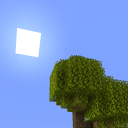

# Simple Seasons

Minecraft mod that adds a simple season system.

## Features

- Per-block, per-biome season colors
    - Resource pack-based
    - Automatic registration of block/item colors defined in resource packs using Fabric API
    - Hot reloading (reloading season colors while in a world)
- Smooth transition between seasons
    - Seasons gradually progress into the next season
    - Season colors are updated every N seconds on all clients
- Dry and wet seasons
    - Used in savannas (dry climate; `#c:climate_dry`) and jungles (wet climate; `#c:climate_wet`) by default
    - Configurable per-biome by changing the biome tag `data/simple_seasons/tags/worldgen/biome/has_wet_and_dry_seasons.json`
- Per-world seasons
    - Any world with unfixed time will have seasons
- Ice and snow formation (during winter) and melting (during other seasons)
    - Ice won't form on oceans
    - Snow can pile up on ice (by default)
- Default built-in resource pack
    - Season colors for vanilla Minecraft blocks and items
- Config options (and a config GUI using YACL)
    - Season progress update rate
    - Season length multiplier

## Dependencies

### Required

- [Fabric API](https://modrinth.com/mod/fabric-api)
- [YetAnotherConfigLib](https://modrinth.com/mod/yacl)

## Compatibility info

### Compatible mods

- Sodium

### Incompatibilities

See the [issue tracker](https://github.com/steves-underwater-paradise/simple-seasons/issues?q=is%3Aissue+is%3Aopen+sort%3Aupdated-desc+label%3Acompatibility)
for a list of incompatibilities.

## Download

See the version info in the filename for the supported Minecraft versions.  
Made for the Fabric and Quilt modloaders.
Server-side and client-side.

## FAQ

- Q: Will you be backporting this mod to lower Minecraft versions?  
  A: No.

- Q: Does this mod work in multiplayer?  
  A: Yes.

- Q: Does only the server need this mod or does the client need it too?  
  A: Both the server and clients need this mod.

## Attribution

Thank you to [Andrew Grant](https://github.com/Andrew6rant) and [Bawnorton](https://github.com/Bawnorton) (for their previous works
related to season color transitions and Sodium compatible chunk rebuilding), [JorisDeBeer](https://github.com/JorisDeBeer) (for his
contributions to Simple Seasons) and [GrandmaPork](https://github.com/GrandmaPork) (for feedback).

## License

This project is licensed under LGPLv3, see [LICENSE](https://github.com/steves-underwater-paradise/simple-seasons/blob/1.20.x/LICENSE).
